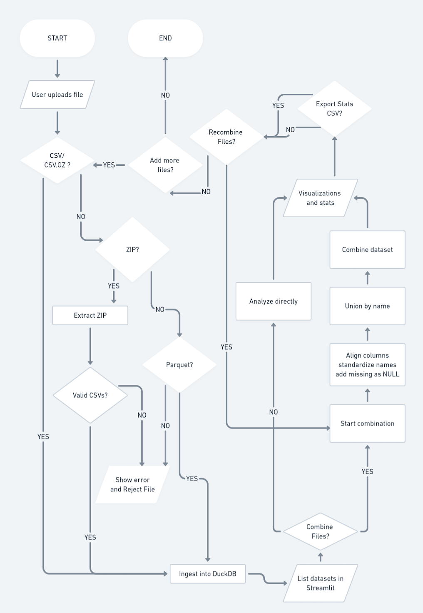

# EDA Dashboard

A batch-first, stream-ready **Exploratory Data Analysis (EDA) dashboard** for exploring datasets, detecting bias, and generating reproducible insights.  

The dashboard is designed to:  
- Handle multiple data formats (CSV, CSV.GZ, Parquet, ZIP).  
- Provide automated profiling, visualization, and fairness/drift checks.  
- Support batch workflows for stability, with hooks for optional “live” updates in the future.  

### Running the Application

#### Requirements

- Docker and Docker Compose ([Install Docker](https://docs.docker.com/get-docker/))
- No Python installation or virtual environment needed!

#### Quick Start with Docker (Recommended)

Start both the API backend and Streamlit frontend:
```bash
docker-compose up
```

Access the application:
- **Frontend (Streamlit):** http://localhost:8501
- **API Backend:** http://localhost:8000
- **API Documentation:** http://localhost:8000/docs

Stop the application:
```bash
# Press Ctrl+C, then run:
docker-compose down
```

**Note:** The FastAPI backend is functional and can be tested via the `/docs` page, but the Streamlit frontend is not yet integrated to call the API. Both systems work independently and share the same DuckDB database file.

---

#### Alternative: Running Without Docker

If you prefer to run without Docker:

**Requirements:**
- Python 3.10+
- Virtual environment recommended (e.g., `venv` or `conda`)

Install dependencies and set up the project:
```bash
pip install -e .
```

**Option 1: Streamlit Only**
```bash
streamlit run app/Dashboard.py
```
Access at http://localhost:8501

**Option 2: With FastAPI Backend**

Terminal 1 - Start API:
```bash
uvicorn api.main:app --reload --host 127.0.0.1 --port 8000
```

Terminal 2 - Start Frontend:
```bash
streamlit run app/Dashboard.py
```

- API: http://127.0.0.1:8000
- Frontend: http://localhost:8501
- API Docs: http://127.0.0.1:8000/docs

---

## Interactive Visualization

Interactive visualization is a core feature of the dashboard. The system uses [Streamlit](https://streamlit.io/) to provide a responsive web-based interface and will integrate Plotly for richer, interactive charts.  

Planned capabilities include:  
- **Exploration**: Upload datasets and interactively view tables, feature distributions, and correlations with adjustable parameters and filters.  
- **Distributions**: Histograms, KDE plots, and bar charts with interactive zoom and pan.  
- **Correlation Heatmaps**: Hoverable heatmaps and pair plots for exploring feature relationships.  
- **Fairness & Drift**: Dynamic selection of reference vs. current datasets and sensitive attributes, with metrics and plots updated in real time.  
- **Extensibility**: Designed to support advanced charting features such as tooltips, drill-downs, and export options.  

---

## Architecture Diagram


---

## Roadmap

### MVP (Batch-first)

* Upload dataset (CSV/Parquet)
* Automated profiling (summary stats, distributions, correlations)
* Interactive visualizations (via Streamlit + Plotly)
* Bias/fairness checks with [Evidently](https://github.com/evidentlyai/evidently) & [Fairlearn](https://github.com/fairlearn/fairlearn)
* Store metrics in DuckDB
* Streamlit dashboard with charts and reports

### Stretch Goals

* Background jobs for “live” refresh (microbatch or file-watcher)
* Thin FastAPI service for cached results and long-running tasks
* Export reproducible reports


