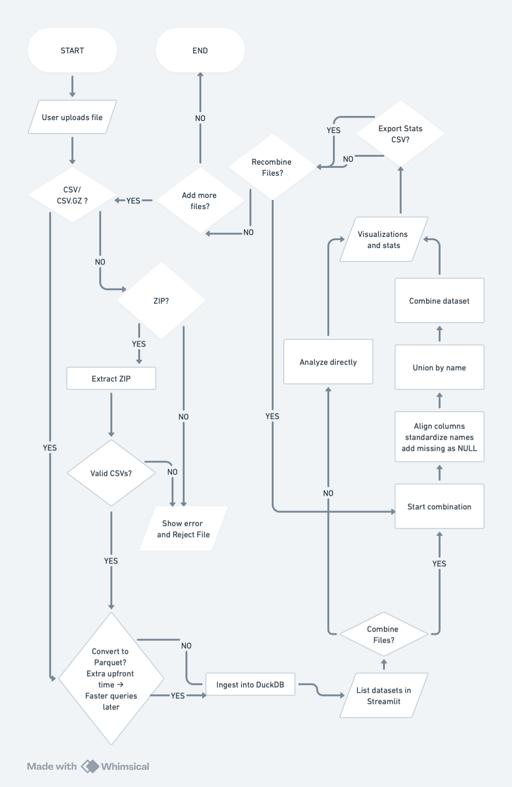

# EDA Dashboard

An **Exploratory Data Analysis (EDA) dashboard** for exploring datasets, detecting bias, and generating reproducible insights.  

The dashboard is designed to:  
- Handle multiple data formats (CSV, CSV.GZ, Parquet, ZIP).
- Provide automated profiling, visualization, and fairness/drift checks.
- Support batch processing with architecture designed for future streaming capabilities.

### Running the Application

#### Requirements

- Docker and Docker Compose ([Install Docker](https://docs.docker.com/get-docker/))
- No Python installation or virtual environment needed!

#### Quick Start with Docker (Recommended)
Start both the API backend and Streamlit frontend:
```bash
docker-compose up
```
Access the application:
- **Frontend (Streamlit):** http://localhost:8501
- **API Backend:** http://localhost:8000
- **API Documentation:** http://localhost:8000/docs

Stop the application:
```bash
# Press Ctrl+C, then run:
docker-compose down
```

---

#### Alternative: Running Without Docker

If you prefer to run without Docker:

**Requirements:**
- Python 3.10+
- Virtual environment recommended (e.g., `venv` or `conda`)

Install dependencies and set up the project:
```bash
pip install -e .
```

**Running Locally:**

Terminal 1 - Start API:
```bash
uvicorn api.main:app --reload --host 127.0.0.1 --port 8000
```

Terminal 2 - Configure API URL and start frontend:
```bash
cp .env.example .env
```

Edit .env to set your API URL then start the frontend
```
echo API_BASE_URL="http://127.0.0.1:8000" > .env
streamlit run app/Dashboard.py
```

Access:
- API: http://127.0.0.1:8000
- Frontend: http://localhost:8501
- API Docs: http://127.0.0.1:8000/docs

**Note:** The `API_BASE_URL` environment variable tells the frontend where to find the API. By default, it uses `http://api:8000` (for Docker), so you must set it to `http://127.0.0.1:8000` when running locally.

---

## Interactive Visualization

Interactive visualization is a core feature of the dashboard. The system uses [Streamlit](https://streamlit.io/) to provide a responsive web-based interface and integrates Plotly for richer, interactive charts.  

Capabilities include:  
- **Exploration**: Upload datasets and interactively view tables, feature distributions, and correlations with adjustable parameters and filters.  
- **Distributions**: Histograms, KDE plots, and bar charts with interactive zoom and pan.  
- **Correlation Heatmaps**: Hoverable heatmaps and pair plots for exploring feature relationships.  
- **Fairness & Drift**: Dynamic selection of reference vs. current datasets and sensitive attributes, with metrics and plots updated in real time.  
- **Extensibility**: Designed to support advanced charting features such as tooltips, drill-downs, and export options.  

---

## Architecture Diagram


---
## Future enhancments
Scatter plot matrix - numerical columns
generalized plot matrix - all columns
strip plot instead of box plot

https://seaborn.pydata.org/examples/horizontal_boxplot.html
